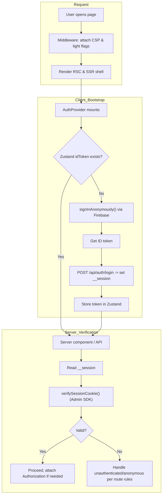
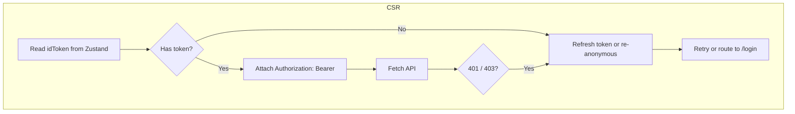
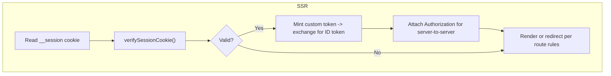
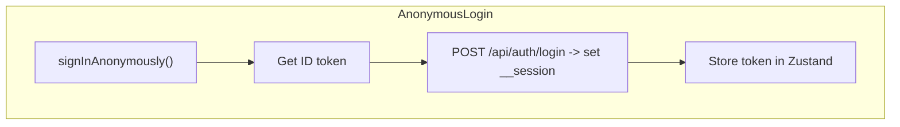
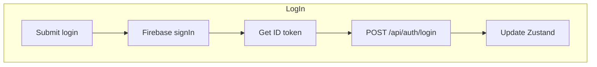
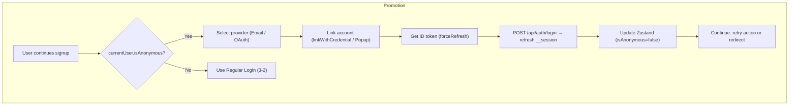
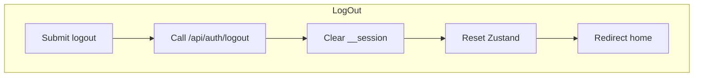

# Next.js + Firebase Auth Flow (Client-Driven)

Target: Next.js 15 (App Router, RSC) + TypeScript 5
Stack: Firebase Auth, Zustand, TanStack Query, Tailwind/shadcn, Vercel

This document specifies the client-driven authentication flow using Firebase Auth. It emphasizes minimal middleware, client-side anonymous bootstrap, and server-side verification in route handlers and server components.

## Summary

| Flow Diagram                  | Purpose                                                                                 |
| ----------------------------- | --------------------------------------------------------------------------------------- |
| Overview                      | High-level control flow: middleware headers, client bootstrap, server verification      |
| CSR / SSR & API Requests      | How tokens are attached and refreshed in CSR, and verified in SSR                       |
| Login / Logout / Promotion    | Anonymous, regular login, upgrade (link), logout                                        |

## 1. Overview

### 1-1. Principles

- Minimal middleware: only security headers (CSP, HSTS, etc.) and light gating flags.
- Client-driven anonymous bootstrap: perform anonymous login in the browser to avoid Edge runtime restrictions.
- Server verification: use Admin SDK in server components and route handlers to verify session cookies.
- Protected features: apply per-route rules in server code; use client modals for upgrade prompts.

### 1-2. Middleware Roles (Lightweight)

- Attach security headers (CSP with nonce, connect-src for API/WebSocket, frame-src for Vercel Live in non-prod).
- Optionally add non-blocking flags (e.g., `x-protected-route`) that the client can read to show modals.
- Do not call Admin SDK from middleware; verification happens in server components/route handlers.

## 2. CSR / SSR & API Requests

### 2-1. CSR (Client)

- Client keeps auth state via Firebase Web SDK and mirrors essentials in Zustand (`user`, `idToken`, `authInitialized`).
- Background anonymous sign-in runs globally in `AuthProvider` on first mount when there is no user yet. It then POSTs `/api/auth/login` to set `__session`.
- For client API calls, prefer a fetch wrapper that attaches `Authorization: Bearer <idToken>` from the current Firebase user. On `401/403`, refresh token and retry once.
- If the client has no user (e.g., after signOut), show login UI or allow anonymous bootstrap depending on feature requirements.

### 2-2. SSR (Server)

- In server components/route handlers, read `__session` and verify via `verifySessionCookie()`.
- For backend calls from the server, `getServerAuthorizationHeader()` mints a custom token for the UID and exchanges it for an ID token via Identity Toolkit, then returns `Authorization: Bearer <idToken>`.
- If verification fails, apply route policy: render limited UI, redirect to `/login`, or prompt upgrade.

Implementation notes
- Emulator mode: when `FIREBASE_AUTH_EMULATOR_HOST` is set, `__session` stores the ID token directly and verification uses `verifyIdToken` instead of `verifySessionCookie`.
- Identity Toolkit base URL switches to the emulator host when configured; otherwise uses the public endpoint. `FIREBASE_API_KEY` must be available on the server for the custom-token exchange.

## 3. Login / Logout / Signup (Promotion)

### 3-1. Anonymous Login

- Trigger: `AuthProvider` global mount when there is no current user.
- Token/Cookie: obtain ID token; POST `/api/auth/login` sets `__session` (HttpOnly, Secure, SameSite=Lax).
- Client State: store `{ user, idToken, isAnonymous: true }` in Zustand.
- Errors: retry with backoff; skip offline; proceed with limited UI if needed.

### 3-2. Regular Login

- Trigger: user submits credentials or OAuth provider.
- Token/Cookie: after sign-in, get ID token; POST `/api/auth/login` sets or refreshes `__session`.
- Client State: update `{ user, idToken, isAnonymous: false }`; clear any anonymous-only flags.
- Note: if the current user is anonymous, prefer Promotion (3-3) to preserve UID.
- Errors: show friendly errors (e.g., wrong-password, user-not-found, too-many-requests); do not clear existing session on failure.

### 3-3. Signup (Promotion) (Anonymous → Regular)

- Preserves UID; `isAnonymous` becomes false; profile merges on link.
- Refresh `__session` using the linked account’s ID token to align SSR/API.
- Errors: handle credential-in-use, requires-recent-login, and cancel; keep anonymous state on failure.

### 3-4. Logout

- Server-only: `/api/auth/logout` clears `__session`.
- Client full logout: call `signOut()` to clear Firebase client state; `AuthProvider` will auto-anonymize on the next mount and reissue a session cookie.
- UX: after logout, redirect to `/`; if you want to avoid auto-anonymous immediately on auth pages, gate the bootstrap in the UI logic.

### 3-5. Auth API Endpoints (Implemented)

- `POST /api/auth/login`: body `{ idToken }` (zod-validated). Sets `__session` with `HttpOnly`, `SameSite=Lax`, `secure` in production, `maxAge=SESSION_COOKIE_MAX_AGE` (default 14 days). In emulator, the ID token itself is stored as the cookie value.
- `POST /api/auth/logout`: clears `__session`.
- `GET /api/auth/session`: verifies `__session`. On success returns `{ uid, email, emailVerified, isAnonymous, customClaims }`. On 401, also deletes the cookie to avoid loops.

## 4. Protected Routes & Modal Pattern

- Protected pages (e.g., `/create-post`, `/my/posts`) enforce on the server:
  - Verify session cookie; if anonymous or unauthenticated, redirect to `/login` or render a prompt.
- Protected actions in public pages use client modals (Option C):
  - Detect anonymous state in the client; show modal to log in or upgrade; after success, retry the action.

Route-change ping (implemented)
- On every client navigation, `AuthProvider` calls `/api/auth/session`. If it returns 401 and the client has a current Firebase user, it fetches a fresh ID token and POSTs `/api/auth/login` to reissue `__session` silently.

## 5. Middleware & Security (Edge-Friendly)

- Middleware responsibilities:
  - Set CSP with nonce, including `connect-src` for API/WebSocket and `frame-src` for Vercel Live in non-prod.
  - Do not verify tokens; do not call Admin SDK at the edge.
  - Use selective `matcher` to avoid static assets and API routes where not needed.

## 6. Environment & Configuration

- Required client env (`NEXT_PUBLIC_*`): Firebase config (apiKey, authDomain, projectId, appId; optionally storageBucket, messagingSenderId), `NEXT_PUBLIC_API_BASE_URL`, `NEXT_PUBLIC_WEBSOCKET_URL`.
- Server env: `API_BASE_URL`, `FIREBASE_PROJECT_ID`, `FIREBASE_CLIENT_EMAIL`, `FIREBASE_PRIVATE_KEY`, `FIREBASE_API_KEY` (required for server custom-token exchange), optional `FIREBASE_AUTH_EMULATOR_HOST`.
- `APP_ENV` controls CSP strength (enabled for `staging`/`production`).
- `SESSION_COOKIE_MAX_AGE` (seconds) configures `__session` lifetime; default 14 days. Prefer ≥ 300s in testing.

## 7. Rationale

- Next.js 15 + App Router best practices recommend minimal middleware and pushing complex logic to server components/route handlers.
- Vercel Edge middleware cannot use Node-only Admin SDK; client bootstrap avoids runtime mismatch and extra redirects.
- Zustand + TanStack Query provide robust client token management and retry behavior.

## 8. Verification Checklist

- Anonymous bootstrap: fresh browser profile → first mount auto-creates anonymous user and calls `/api/auth/login`.
- Route-change ping: with an expired/missing cookie but a signed-in client, navigation triggers silent cookie reissue.
- Protected SSR page: missing/invalid cookie redirects or renders prompt per route policy.
- Regular login: after sign-in, `/api/auth/login` updates the cookie; SSR identity available.
- Promotion: linking anonymous → regular maintains UID; cookie refreshed.
- Logout: server-only clears cookie; full logout (also `signOut`) clears client; next mount re-anonymizes.
 - Headers: CSP allows Firebase Auth endpoints, backend API, and WebSocket; Vercel Live iframe permitted only in non-prod.

## 9. Session Behavior: Anonymous vs Regular

- Definitions: `__session` is the server session cookie used for SSR; Firebase Web SDK keeps client auth state in IndexedDB/localStorage.
- Cookie Expiry: when `__session` expires, the client remains signed in (both anonymous and regular). Silent reissue by posting a fresh ID token to `/api/auth/login` restores SSR without user action.
- Client Storage Loss:
  - Anonymous: losing client storage (signOut, clear site data, incognito closed, iOS/Safari eviction) destroys the refresh token and anonymous UID reference. A new `signInAnonymously()` creates a new UID; data tied to the old UID is not accessible.
  - Regular: user can sign in again with credentials/provider; the same UID is restored. Posting the new ID token to `/api/auth/login` recreates `__session`.
- Logout:
  - Calling `/api/auth/logout` clears `__session`. If you also call `signOut(auth)`, the client becomes unauthenticated and will re-anonymize on next mount (per 3‑1) unless suppressed on `/login`/`/signup`.
  - If you only clear `__session` but keep the client signed in, SSR will be restored on the next silent reissue.
- Promotion (Anonymous → Regular): linking keeps the same UID. All data keyed by UID continues to belong to the user after linking; `isAnonymous` flips to false and `__session` should be refreshed.
- Persistence Guidance: prefer local persistence (`indexedDBLocalPersistence`/`browserLocalPersistence`) and avoid calling `signOut()` for anonymous users you intend to preserve. Consider `navigator.storage.persist()` to reduce eviction risk on Chromium.
